# Filter For Folks 


### Project Goals

Filter for Folks is a Business to Consumer (B2C) e-commerce site.

[ Link to deployed site](https://filter-for-folks-58441ed4952a.herokuapp.com/) 

The sites primary audience will be people who are living in condominiums and require air filter replacement in their apartments.

- Create a user-friendly platform for consumers seeking ventilation filters for their condos.
- Provide a diverse selection of filters categorized by location and type for easy navigation.
- Implement secure registration, login, and checkout processes to enhance user trust and satisfaction.
- Offer clear product descriptions, pricing, and sizing options to aid in informed decision-making.
- Enable easy management of products and orders for efficient store operations.

### Disclaimer

This project was inspired by the Stockholm based company [Folkfilter](https://www.folkfilter.se/) that I used to work for as an account manager. It gave me the understanding related to the target audience and daily challenges I faced during my employment. I was also taken a break from this course at Code Institute before I worked on Filter for Folks.  

With this message I want to show them my gratitude that I was allowed to use their product images into my website. Other product images was taken through a google search and from another Swedish company calls [Biltema](https://www.biltema.se/). 

## Table of Contents


1. [User stories](#user-stories)

2. [Design](#design)

3. [Imagery](#imagery)

4. [Facebook page](#facebook-page)

5. [Technologies Used](#technologies-used)

6. [Features](#deployment--local-development)

7. [Future Implementations](#future-implementations)

8. [Accessibility](#accessibility)

9. [Deployment & Local Development](#deployment--local-development)

10. [Features Left to Implement](#features-left-to-implement)

11. [Testing](#testing)

12. [Credits](#credits)

13. [Credits to my mentor](#credits-to-my-mentor)

14. [Credits to TUT Support on Code Institute](#credits-to-tut-support-on-code-institute)


### User Stories

| User Story ID | As a/an | I want to be able to ... | So that I can... |
| :--- | :--- | :--- | :---|
| **VIEWING & NAVIGATION** |
| 1 | Shopper | view a list of ventilation filters available on Filter Folks | select the filter I need for my condo |
| 2 | Shopper | view specific categories of filters, such as those designed for placement behind radiators or above windows | to quickly find products relevant to my needs. |
| **REGISTRATION & USER ACCOUNTS** |
| 3 | Site User | Easily register for an account on Filter Folks| Enabling me to view my profile and order history |
| 4 | Site User | Easily log in or out | Access my personal account information |
| 6 | Site User | Have a personalized user profile | View my personal order history and order confirmations, and save my payment information |
| **SORTING & SEARCHING** |
| 7 | Shopper | Sort the list of available filters by price, rating, and category | To identify the best options for my needs. |
| 8 | Shopper | Sort a specific category of Air Filter | Find the best-priced or best-rated product in a specific category, or sort the products in that category by name |
| 9 | Shopper | Search for a product by name or description | Find a specific product I'd like to purchase |
| 10 | Shopper | Easily see what I've searched for and the number of results | Quickly decide whether the product I want is available |
| **PURCHASING & CHECKOUT** |
| 11 | Shopper | Easily select the size and quantity of filters I wish to purchase | Ensuring I order the correct products |
| 12 | Shopper | View  items in my shopping bag, adjust quantities if necessary | enter payment information securely for checkout. |
| 13 | Shopper | View an order confirmation after checkout | Verify that I haven't made any mistakes |
| 14 | Shopper | Receive an email confirmation after checking out | Keep the confirmation of what I've purchased for my records |
| **ADMIN & STORE MANAGEMENT** |
| 15 | Store Owner | Add a product| Add new items to my store |
| 16 | Store Owner | Edit/update a product | Change product prices, descriptions, images and other product criteria |
| 17 | Store Owner | Delete a product | Remove items that are no longer for sale |

---

## Design

### Colour Scheme

- This the total color scheme for the whole website. If I have must have missed something in there I must apologise in advanced before you continue to read this readme file further. 


### Imagery

The opening page was added from [Pexels](https://www.pexels.com/) and it was also used in other areas of the website to appear professional depending on the navigation. A few product images as mentioned in the beginning the readme file was taken from a simple [Google Search](https://www.google.com/webhp?hl=en&sa=X&ved=0ahUKEwjyuJSQxYaHAxWeAxAIHS0CDz0QPAgJ) e.g. [Rubber Strips](https://www.google.com/search?sca_esv=119356d5c00122f0&rlz=1C5CHFA_enSE941SE942&q=rubber+strips&udm=2&fbs=AEQNm0Aa4sjWe7Rqy32pFwRj0UkWd8nbOJfsBGGB5IQQO6L3J_TJ4YMS4eRay1mUcjRHkZwkNnuzbvXdHSnZt8SI-ypec-U-KajbXe9hbStxnPJuWxTCm8NISzlcRgh-mkg5a1XRWoiIVMkT5RYbraDRnHsJFse2AdcMQ0qNzsDHDLrzlWTINDALsSJJNGpMRvO4XnQg0w6_&sa=X&ved=2ahUKEwii2tiNxYaHAxWDLBAIHcy3CvAQtKgLegQIFBAB&biw=1440&bih=779&dpr=2) and from the Swedish hardware store [Biltema](https://www.biltema.se/en-se/). 

The reason for it was made this way was to save time and find a product image that easily represented of its usage for the potential buyer. I wasn't allowed to private photos of [Folkfilter's](https://www.folkfilter.se/) tools and they use to their air filter replacement services. 

### Facebook page 

- Facebook does not tolerate "fake" business profiles on its platform, so there's a risk that my business page might be deactivated if it's not deemed authentic, particularly if it was created using a new, empty Facebook user profile.

- To prevent any restraints regarding the presentation of my project in the readme.md file - I have  included some screenshots of the Facebook page in my documentation and followed those instructions by Code Institute. 

- If the Filter for Folk's [Facebook Page](https://www.facebook.com/profile.php?id=61561386792798) still exist -  please feel free to visit it!


---

## Technologies Used

### Languages Used

HTML, CSS, JavaScript, Python 3

### Databases Used

* sqlite3 - for the development database.
* ~~ElephantSQL - For the deployed sites database.~~ - ElephantSQL announced EOL for its service in February 2024.
* [Code Institute Database (DB)](https://dbs.ci-dbs.net/) For the deployed site database

### Frameworks Used

* [Django](https://www.djangoproject.com/) - A high-level Python web framework that encourages rapid development and clean, pragmatic design.

* [Bootstrap](https://getbootstrap.com/docs/4.6/getting-started/introduction/) - Version 4.6 - A framework for building responsive, mobile-first sites.

### Libraries & Packages Used

* [Django Allauth](https://django-allauth.readthedocs.io/en/latest/)  - Used for authentication, registration & account management.

* [dj_database_url](https://pypi.org/project/dj-database-url/0.5.0/) - Allows us to utilise the DATABASE_URL environment variable.

* [Stripe](https://pypi.org/project/stripe/) - Version 9.11.0 - To allow us to utilise the Stripe API for payments.

* [gunicorn](https://pypi.org/project/gunicorn/) - Version 22.0.0 - a Python WSGI HTTP Server

* [psycopg2](https://pypi.org/project/psycopg2/) - A postgres database adaptor.

* [pillow](https://pypi.org/project/Pillow/)  - A python imaging library.

* asgiref

* [django-countries](https://pypi.org/project/django-countries/7.6.1/) - This is the latest stable version that is compatible with GitPod

* [django-crispy-forms](https://pypi.org/project/django-crispy-forms/) - provides a tag and filter that lets you quickly render forms

* oauthlib

* pytz

* requests-oauthlib

* sqlparse

* psycopg2 - a postgres database adapter which allow us to connect with a postgres database

* django-storages - a storage backend library


### Programs Used


* [GitHub](https://github.com/) - To save and store the files for this project.

* [Pip](https://pypi.org/project/pip/) - A tool for installing Python packages.

* [Google Dev Tools](https://developer.chrome.com/docs/devtools/) - To troubleshoot, test features and solve issues with responsiveness and styling.

* [Mail Chimp](https://mailchimp.com/?currency=SEK) - To create newsletters. 

* [Color Scheme](https://coolors.co/000000-2f1000-621b00-945600-c75000) - To create colorschemes. 

### Stripe

* [Stripe](https://stripe.com/gb) has been used in the project to implement the payment system.

Stripe for the website is currently in developer mode, which allows us to be able to process test payments to check the function of the site.

| Type | Card No | Expiry | CVC | ZIP |
| :--- | :--- |:--- | :--- | :--- |
| Success| Visa | 4242 4242 4242 4242 | A date in the future | Any 3 digits | Any 5 digits |
| Require authorisation | 4000 0027 6000 3184 | A date in the future | Any 3 digits | Any 5 digits |
| Declined | 4000 0000 0000 0002 | A date in the future | Any 3 digits | Any 5 digits |

Stripe Documentation- setting up stripe elements to accept payment [docs](https://stripe.com/docs/js)

---

## Features

#### New Visitor view:

1. Once you come to the Filter for Folks website the opening page looks like this: 


2. As visitor you have multiple options. For starters if you can click on the "OUR INVENTORY" button to come the total inventory page. 


3. In there you are able to see the product description and images of each product, however to prevent other competitors to see what our prices are we have set up a function that a new visitor needs to register an account at Filter for Folks. 


4. This is to generate substantial amount of traffic to the website and arouse curiosity. Once you click on the gray button that says "Wanna see our prices?" it takes you to the register page.

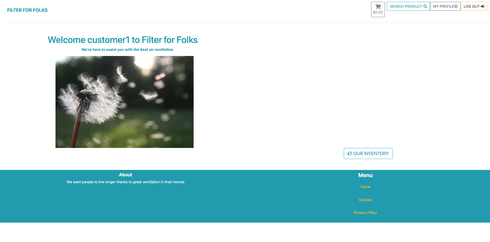

#### Registered Personal Account view:

5. Once you have created an account it it greats you with a new message on the home page. This is an indication that you're in and a sense of change within the navigation for the visitor. Who is now our full customer with more accessibility on the page. Besides has the navbar been updated:

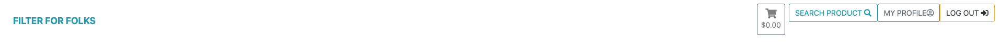

6. The navbar has also been updated for the user. With 3 new buttons to account member. Once you click on uppercase button "search products". You'll enter product filter page.  

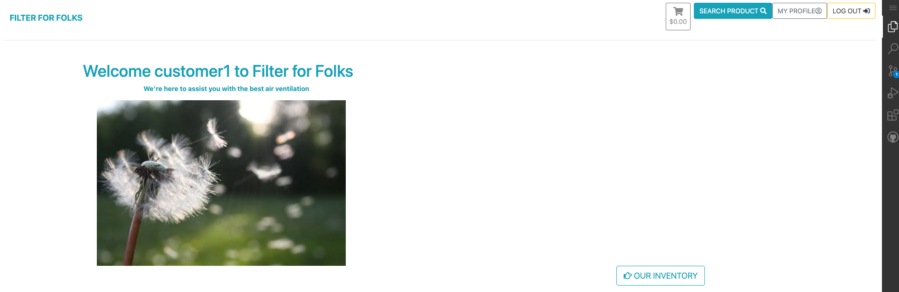
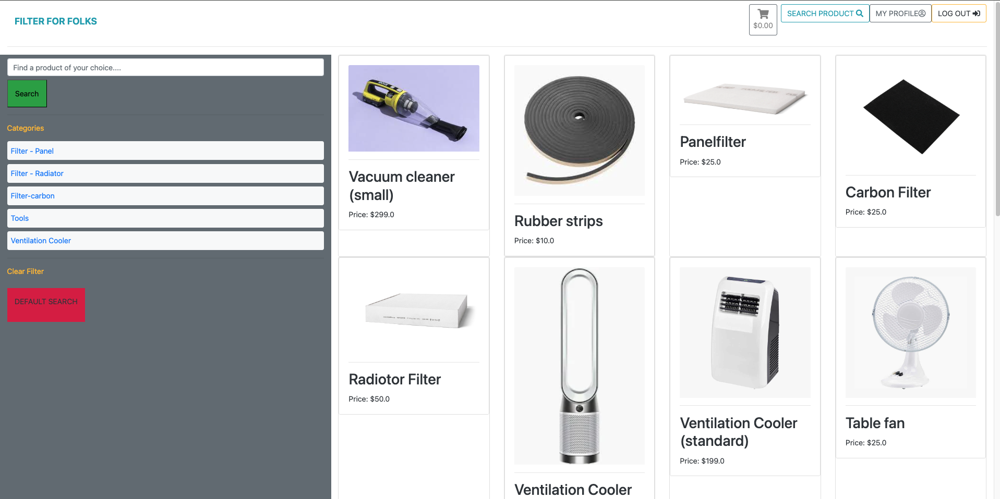
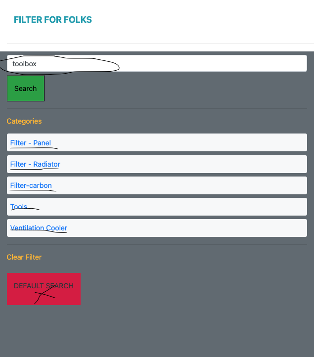

7. In the tab to the left of the product filter you are able to type your product of interest in the search bar. e.g, you search toolbox: 

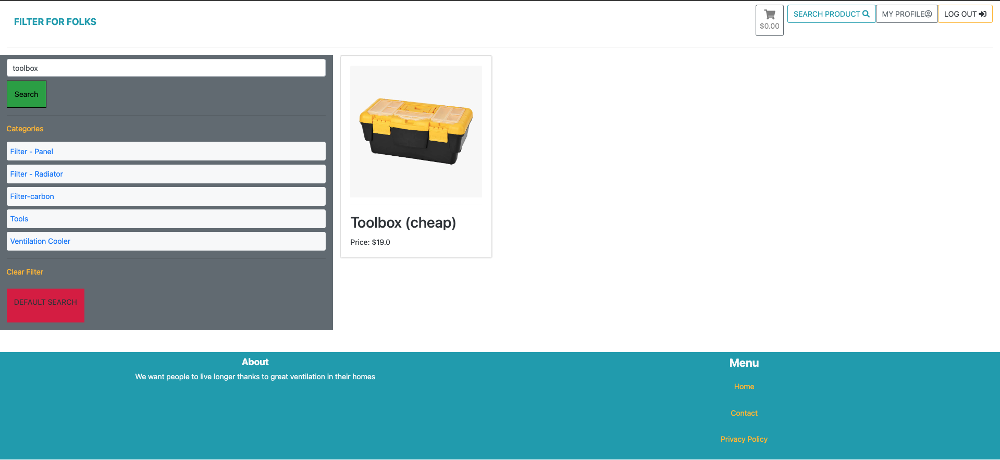

8. However, in order to see all the products again and make another product search you need to press on default button to clear the filter. 

9. If chooses one of the categories you'll see either one or several items in the filter. * As mention the user needs to use the default filter button to see all the inventory again. * 

#### Purchase experience view:

10. If you decides to you purchase something, then you click on one of the products. In this case we purchases a vacuum cleaner: 

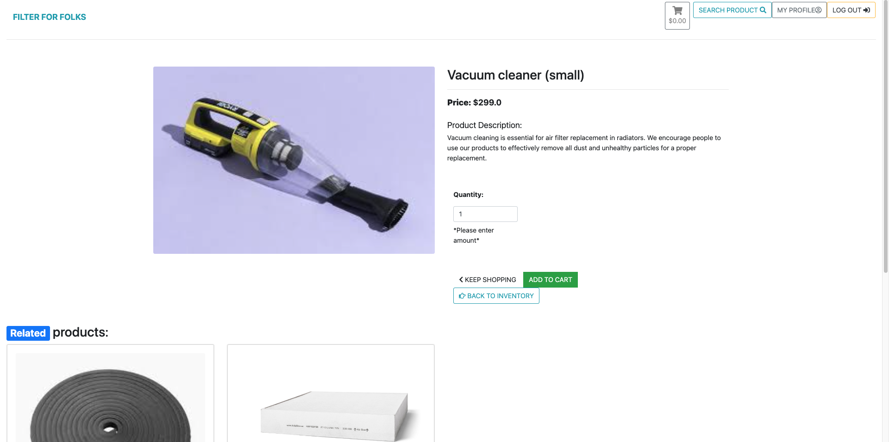

11. You immediately navigated to the product detail page where you decides if you want to add this item into the shopping cart and its quantity. Plus you see an update in terms of its color (from gray to turquoise) and quantity in the cart. 

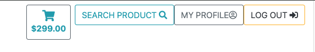

12. In the shopping it looks like this where you can do its changes and or if you want to delete the product entirely. This is before you do your checkout:

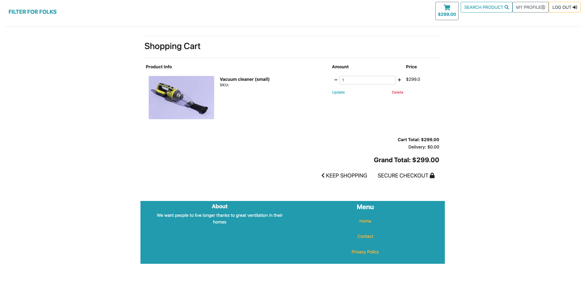

13. Right after you click on secure checkout you'll be navigated to the checkout page where you can add the required personal details for you purchase:

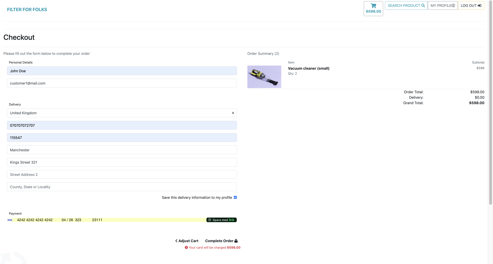

14. Once you clicked on the secure checkout you will be receiving a purchase confirmation: 


#### Tracking purchase view:

15. As a user you are able to do some updates in your personal account, if your personal details has changed and also you can look on previous orders (related to your personal account) - you'll able to find this necessary information there. Plus by clicking on the "order number" you'll be navigated back to the confirmation page. Thus it's an easy user experience to the customer and also important if they want to call or send an email to the Filter for Folks customer service in case of tracking the order. 

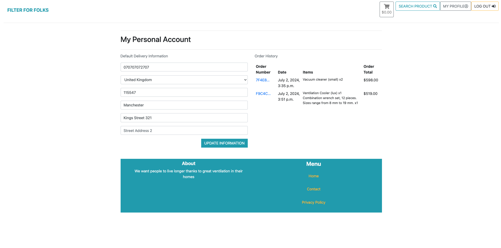

#### Reach out to the business view:

16. If you want to reach out to the business you need to click on the "contact" button in the footer below or the second nav element. The user can either contact by either email and calling the store. On the contact page the user is able to sign up for the newsletter connected to the Mail Chimp and find Filter for Folks Facebook page. (How the facebook looks like you'll find it above).

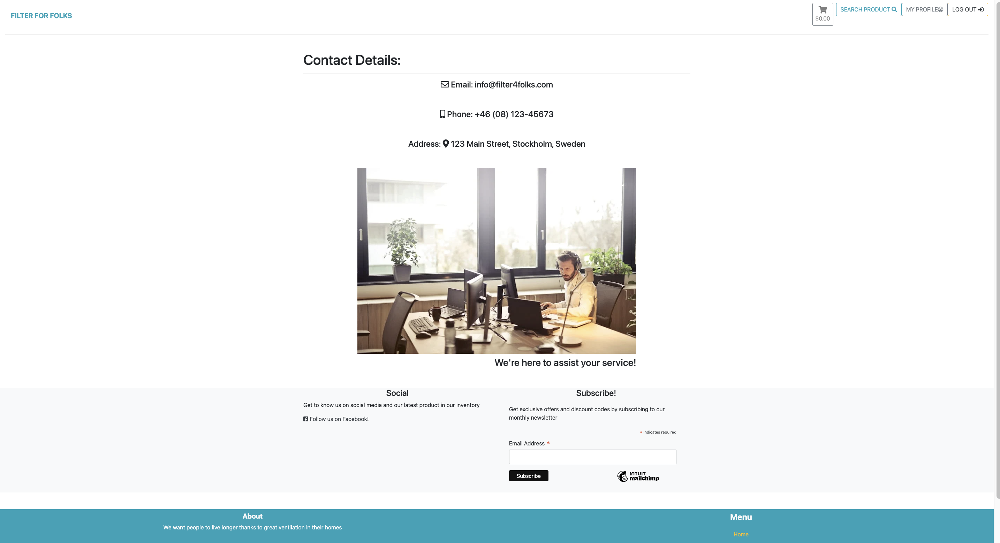


17. How do you get yourself back to the home page? Either clicking on the business name "Filter for Folks" in the top left - in the nav element below. In there you also find the page of Filter for Folk's [Privacy Policy](https://www.termsfeed.com/live/1a7cc1bc-3fec-45b9-87a8-a43810a76fdf) to their users and how they are following the [GDPR](https://gdpr-info.eu/).  


#### Sign In & Log Out views:

18. Once you want to leave the website you are clicking on the "logout" button in above nav element and the same comes to if you already have an account though you click on "Sign In" instead: 

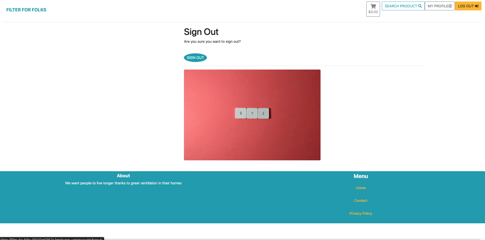

19. Once you click on the sign out then you log out from the page. 

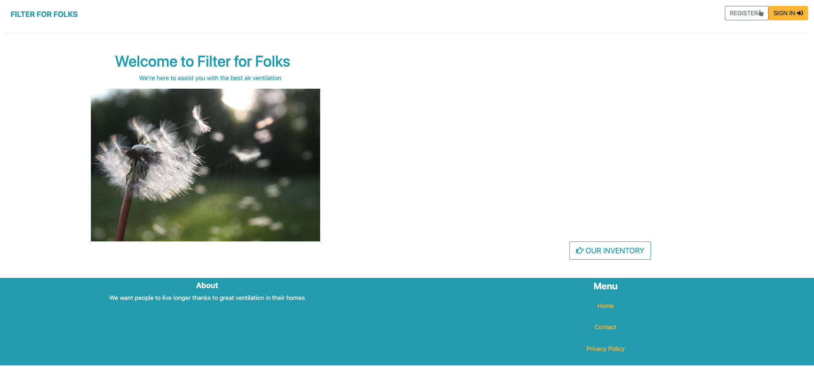

20. The user who clicks on the Sign In button will be directed to this page: 

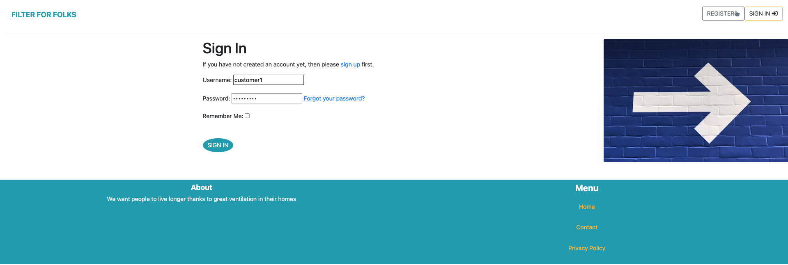

#### Admin view:

21. If you are an admin you are been allocated with a green button that's being called add product. This is to add some new products for the admin into the page and for customer to see how much they have spent in the cart area.

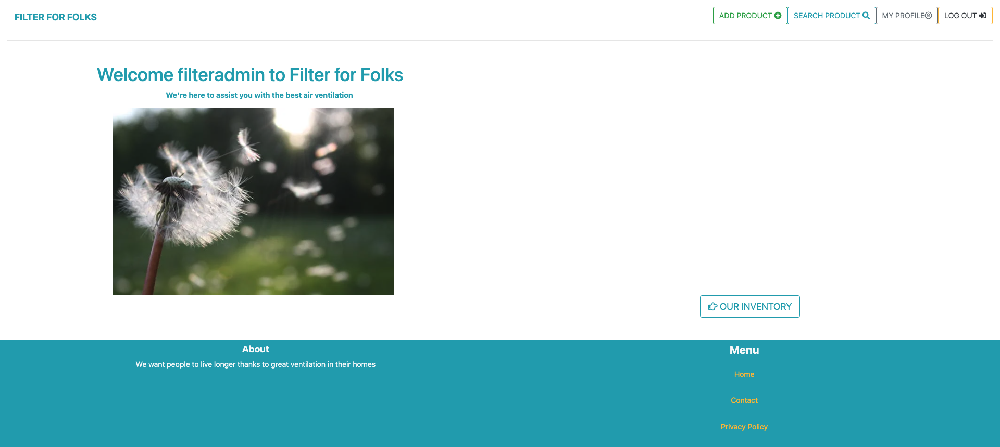

22. The add product page looks like this as the admin can choose name, which category that particular product belongs to, description, price and image. 

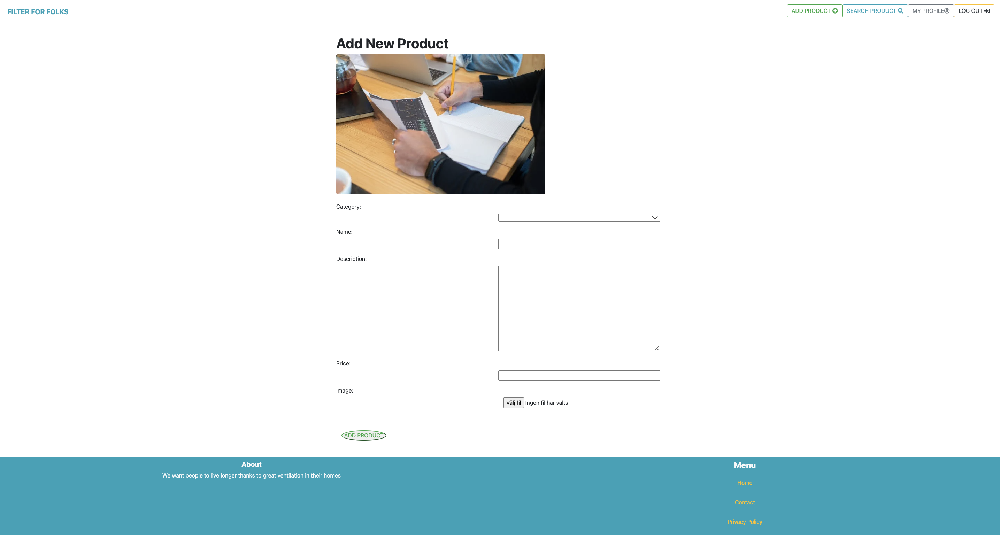


### Future Implementations

- Favicon - wasn't implemented into the project. The reason behind this was that I started my project from scratch and didn't use Boutique Ado as foundation in beginning. Neither allauth packages thus some templates are in the allauth folder and other in core app. 

- A feature that unfortunately was not implemented into the project is that the admin is able to create an category to further enhance the website for its liking.


- Customers can rate the products from 1 to 5 stars. 

- An addition in the product filter element, due to the fact that there are few products in there you are able see what the company got in their storage. However it requires a feature that you can easily distinguish from one product to another. The reason it was not added into the project was to reduce the sense of complexity and save time. 

- No custom 404 error page was made in this project but it will! 

- Unsure if it works after the deployment - the images in this readme file doesn't show themselves or it appears to broken. To whom who ever read this please open the project so you'll se it in the preview. Thank you! 


### Accessibility

I have paid careful attention while coding to make sure the website is as user-friendly as possible for all users. This has been accomplished by:

* Using semantic HTML.
* Using descriptive alt attributes on images on the site.
* Providing information for screen readers where there are icons used and no text.
* Ensuring that there is a sufficient color contrast throughout the site.
* Accessibility was tested using Lighthouse and WAVE and further information can be down the readme file.

## Deployment & Local Development

### Deployment

The project is deployed using Heroku. To deploy the project:

#### **Create the Live Database**

We have been using the sqlite3 database in development, however this is only available for use in development so we will need to create a new external database which can be accessed by Heroku.

1. Go to the [ElephantSQL](https://www.elephantsql.com/) dashboard and click the create new instance button on the top right.
2. Name the plan (your project name is a good choice), select tiny turtle plan (this is the free plan) and choose the region that is closest to you then click the review button.
3. Check the details are all correct and then click create instance in the bottom right.
4. Go to the dashboard and select the database just created.
5. Copy the URL (you can click the clipboard icon to copy)

#### **Heroku app setup**

  1. From the [Heroku dashboard](https://dashboard.heroku.com/), click the new button in the top right corner and select create new app.
  2. Give your app a name (this must be unique), select the region that is closest to you and then click the create app button bottom left.
  3. Open the settings tab and create a new config var of `DATABASE_URL` and paste the database URL you copied from elephantSQL into the value (the value should not have quotation marks around it).

#### **Preparation for deployment in GitPod**

1. Install dj_database_url and psycopg2 (they are both needed for connecting to the external database you've just set up):

   ```bash
   pip3 install dj_database_url==0.5.0 psycopg2
   ```

2. Update your requirements.txt file with the packages just installed:

    ```bash
    pip3 freeze > requirements.txt
    ```

3. In settings.py underneath import os, add `import dj_database_url`

4. Find the section for DATABASES and comment out the code. Add the following code below the commented out database block, and use the URL copied from elephantSQL for the value:

    (NOTE! don't delete the original section, as this is a temporary step whilst we connect the external database. Make sure you don't push this value to GitHub - this value should not be saved to GitHub, it will be added to the Heroku config vars in a later step, this is temporary to allow us to migrate our models to the external database)

    ```python
    DATABASES = {
        'default': dj_database_url.parse('paste-elephantsql-db-url-here')
    }
    ```

5. In the terminal, run the show migrations command to confirm connection to the external database:

    ```bash
    python3 manage.py runserver
    ```

6. If you have connected the database correctly you will see a list of migrations that are unchecked. You can now run migrations to migrate the models to the new database:

    ```bash
    python3 manage.py migrate
    ```

7. Create a superuser for the new database. Input a username, email and password when directed.

    ```bash
    python3 manage.py createsuperuser
    ```

8. You should now be able to go to the browser tab on the left of the page in elephantsql, click the table queries button and see the user you've just created by selecting the auth_user table.

9. We can now add an if/else statement for the databases in settings.py, so we use the development database while in development (the code we commented out) - and the external database on the live site (note the change where the db URL was is now a variable we will use in Heroku):

    ```python
    if 'DATABASE_URL' in os.environ:
        DATABASES = {
          'default': dj_database_url.parse(os.environ.get('DATABASE_URL'))
        }
    else:
        DATABASES = {
            'default': {
                'ENGINE': 'django.db.backends.sqlite3',
                'NAME': os.path.join(BASE_DIR, 'db.sqlite3')
          }
        }
    ```

10. Install gunicorn which will act as our webserver and freeze this to the requirements.txt file:

    ```bash
    pip3 install gunicorn
    pip3 freeze > requirements.txt
    ```

11. Create a `Procfile` in the root directory. This tells Heroku to create a web dyno which runs gunicorn and serves our django app. Add the following to the file (making sure not to leave any blank lines underneath):

    ```Procfile
    web: gunicorn boutique_ado.wsgi:application
    ```

12. Log into the Heroku CLI in the terminal and then run the following command to disable collectstatic. This command tells Heroku not to collect static files when we deploy:

    ```bash
    heroku config:set DISABLE_COLLECTSTATIC=1 --app heroku-app-name-here
    ```

13. We will also need to add the Heroku app and localhost (which will allow GitPod to still work) to ALLOWED_HOSTS = [] in settings.py:

    ```python
    ALLOWED_HOSTS = ['{heroku deployed site URL here}', 'localhost' ]
    ```

14. Save, add, commit and push the changes to GitHub. You can then also initialise the Heroku git remote in the terminal and push to Heroku with:

    ```bash
    heroku git:remote -a {app name here}
    git push heroku master
    ```

15. You should now be able to see the deployed site (without any static files as we haven't set these up yet).

16. To enable automatic deploys on Heroku, go to the deploy tab and click the connect to GitHub button in the deployment method section. Search for the projects repository and then click connect. Click enable automatic deploys at the bottom of the page.

#### **Generate a SECRET KEY & Updating Debug**

1. Django automatically sets a secret key when you create your project, however we shouldn't use this default key in our deployed version, as it leaves our site vulnerable. We can use a random key generator to create a new SECRET_KEY which we can then add to our Heroku config vars which will then keep the key protected.
2. [Django Secret Key Generator](https://miniwebtool.com/django-secret-key-generator/) is an example of a site we could use to create our secret key. Create a new key and copy the value.
3. In Heroku settings create a new config var with a key of `SECRET_KEY`. The value will be the secret key we just created. Click add.
4. In settings.py we can now update the `SECRET_KEY` variable, asking it to get the secret key from the environment, or use an empty string in development:

    ```python
    SECRET_KEY = os.environ.get('SECRET_KEY', ' ')
    ```

5. We can now adjust the `DEBUG` variable to only set DEBUG as true if in development:

    ```python
    DEBUG = 'DEVELOPMENT' in os.environ
    ```

6. Save, add, commit and push these changes.

#### **Setting up Stripe**

1. We now need to add our Stripe keys to our config vars in Heroku to keep these out of our code and keep them private. Log into Stripe, click developers and then API keys.
2. Create 2 new variables in Heroku's config vars - for the publishable key (STRIPE_PUBLIC_KEY) and the secret key (STRIPE_SECRET_KEY) and paste the values in from the Stripe page.
3. Now we need to add the WebHook endpoint for the deployed site. Navigate to the WebHooks link in the left hand menu and click add endpoint button.
4. Add the URL for our deployed sites WebHook, give it a description and then click the add events button and select all events. Click Create endpoint.
5. Now we can add the WebHook signing secret to our Heroku config variables as STRIPE_WH_SECRET.
6. In settings.py:

    ```python
    STRIPE_PUBLIC_KEY = os.getenv('STRIPE_PUBLIC_KEY', '')
    STRIPE_SECRET_KEY = os.getenv('STRIPE_SECRET_KEY', '')
    STRIPE_WH_SECRET = os.getenv('STRIPE_WH_SECRET', '')
    ```

# Testing

---

## Automated Testing

### HTML Validation

[W3C validator](https://validator.w3.org/) was used to validate the HTML in this project.

| Page | Result |
| :--- | :--- |
| Home | [Pass](https://validator.w3.org/nu/?doc=https%3A%2F%2Ffilter-for-folks-58441ed4952a.herokuapp.com%2F) |
| 17 errors| Not affecting the code |
| Inventory page | [Pass](https://validator.w3.org/nu/?doc=https%3A%2F%2Ffilter-for-folks-58441ed4952a.herokuapp.com%2Fproduct%2Fproducts%2F) |
| 2 errors| Not affecting the code |
| Products details | [Pass](https://validator.w3.org/nu/?doc=https%3A%2F%2Ffilter-for-folks-58441ed4952a.herokuapp.com%2Fproduct%2F1%2F) |
| 6 errors| Not affecting the code |
| Add product | [Pass](https://filter-for-folks-58441ed4952a.herokuapp.com/product/newproduct/) |
|IO Error| HTTP resource not retrievable. | The HTTP status from the remote server was: 404. |
| Possible explanation:| It can't access they page since it requires an account|
|Adding products is not an issue despite validation error|
| Edit product | [Pass](https://filter-for-folks-58441ed4952a.herokuapp.com/product/2/edit/) |
|IO Error| HTTP resource not retrievable. | The HTTP status from the remote server was: 404. |
|Editing products is not an issue despite validation error|
| Possible explanation:| It can't access they page since it requires an account|
| Cart | [Pass](https://validator.w3.org/nu/?doc=https%3A%2F%2Ffilter-for-folks-58441ed4952a.herokuapp.com%2Fcart%2F) |
| 5 errors| Not affecting the code |
| Checkout | [Pass](https://validator.w3.org/nu/?doc=https%3A%2F%2Ffilter-for-folks-58441ed4952a.herokuapp.com%2Fcheckout%2F) |
|IO Error| HTTP resource not retrievable. | The HTTP status from the remote server was: 404. |
| Account | [Pass](https://validator.w3.org/nu/?doc=https%3A%2F%2Ffilter-for-folks-58441ed4952a.herokuapp.com%2Faccount%2F) |
|IO Error| HTTP resource not retrievable. | The HTTP status from the remote server was: 404. |

### CSS Validation

[W3C validator](https://validator.w3.org/) was used to validate the CSS in this project.

| File | Result |
| :--- | :--- |
| static/css/base.css | Pass |
| 2 errors| Not affecting the code or project |
| checkout/static/css/checkout.css | Pass |
| 2 errors| Not affecting the code or project |
| profiles/static/css/account.css | Pass |
| 2 errors| Not affecting the code or project |

### JavaScript Validation

[JS Hint](https://jshint.com/) was used to validate the projects JavaScript files.

| File | Result |
| :--- | :--- |
| checkout/static/js/stripe_elements.js | Pass (Mentions one unused variable - stripe) |


### Python Validation

PEP8 style guideline compliance was checked using [pycodestyle](https://pycodestyle.pycqa.org/en/latest/index.html) in the IDE while developing the project and [CI Python Linter](https://pep8ci.herokuapp.com/) was also used to check all python files were free of errors.

| File | Result |
| :--- | :--- |
| filter_folk/settings.py | Pass |
| filter_folk/urls.py | Pass |
| cart/contexts.py | Pass |
| cart/urls.py | Pass |
| cart/views.py | Pass |
| checkout/admin.py | Pass |
| checkout/forms.py | Pass |
| checkout/models.py | |
| checkout/signals.py | Pass |
| checkout/urls.py | Pass |
| checkout/views.py | Pass |
| checkout/webhook_handler.py | Pass |
| checkout/webhooks.py | Pass |
| home/urls.py | Pass |
| home/views.py | Pass |
| product/admin.py | Pass |
| product/forms.py | Pass |
| product/models.py | Pass |
| product/urls.py | Pass |
| product/views.py | Pass |
| product/widgets.py | Pass |
| accounts/forms.py | Pass |
| accounts/models.py | Pass |
| accounts/urls.py | Pass |
| accounts/views.py | Pass |

### Lighthouse Testing

[Google Lighthouse](https://developer.chrome.com/docs/lighthouse/overview/) testing was performed on the site to check for performance, accessibility, best practices and SEO.

#### Desktop


#### Mobile


### WAVE Accessibility Testing

[WAVE](https://wave.webaim.org/report#/https://wave.webaim.org/extension) (web accessibility evaluation tool) was used on the site to check for issues relating to accessibility.

---

### Full Testing

| Feature | Expected Outcome | Testing Performed | Result | Pass or Fail |
| :--- | :--- | :--- | :--- | :--- |

---

## Bugs

### Solved Bugs

| Bug No. | Bug | How I Solved | Evidence |
| :--- |:--- |:--- | :---: |
||||

### Known Bugs

| Bug No. | Bug | Evidence |
| :--- | :--- | :--- |
||||

## Credits

The foundation of this project is based upon the walkthrough project [Boutique Ado](https://github.com/ckz8780/boutique_ado_v1). Since the requirements needed to have a checkout, cart, payment functionalities I used the majority of the code in that element. Because I saw the complexity of doing it dependently and Code Institute's TUT support referred me to the walkthrough project once I got stuck so I was forced to let it go to conduct my coding and followed the requirements for finalize the project accordingly. 

Before I started to work on Filter For Folks, I actually worked on another project and I came across a lot of issues regarding its migrations, stripe and deployment on Heroku. Some of the code from [Gold Scroll](https://github.com/GustavFluur/gold_scroll) has been a great help and a sense of direction if I got stuck during the process. 

I was also on a study break due to personal reasons and during that period I was keeping up my coding skills by working on [Merch Discount](https://github.com/GustavFluur/merch_discount) and this one is based upon the a course from [Learn Django by Building an Online Marketplace – Python Tutorial for Beginners](https://www.youtube.com/watch?v=ZxMB6Njs3ck) & [E-commerce Website using Django | Live Demo | Desphixs](https://www.youtube.com/watch?v=5n8FKv19os0&list=PL_KegS2ON4s53FNSqgXFdictTzUbGjoO-) - recommended by my mentor Jubril Akolade. 

---- 

#### Projects that has supported me thanks to Jubril Akolade (Mentor) 

- [Boutique-Ado by Kera Cudmore](https://github.com/kera-cudmore/Boutique-Ado) & I used the project's readme file as foundation. It might appear the same and I was stressed before I hand it in the project. Thus I some of the content within the readme file is structured the same. Plus I have dyslexia to save some time I was copy and pasted some of the words into my readme file. Likewise it's the same walkthrough project as it for the course at Code Institute. I want to have it addressed into my readme file and thanks for your understanding! 
- [The Quiz Arms by Kera Cudmore](https://github.com/kera-cudmore/TheQuizArms)

### Other projects that have give me an inspiration to this project: 


- [Python Django Web Framework - Full Course for Beginners](https://www.youtube.com/watch?v=F5mRW0jo-U4&t=1795s)
- [How to Build an E-commerce Website with Django and Python](https://www.youtube.com/watch?app=desktop&v=YZvRrldjf1Y) 
- [Python Django Ecommerce CRUD and UUID - Managing multiple addresses](https://www.youtube.com/watch?app=desktop&v=8SP76dopYVo)
- [Building an Ecommerce Store with Django and Stripe Payments (Live Coding)](https://www.youtube.com/watch?app=desktop&v=g96MJj2pPg8&fbclid=IwAR3V1bLoN8-Np_HTYjNOfAGSmYmmWBfp0Lxv0IC_QJkxTbYx_EaHGLTfMU8)


## Credits to my mentor

I want to show my gratitude to my mentor at Code Institute, who guided me in this project. 

- Jubril Akolade 

I also want to highlight my previous mentor who supported me the whole course: 

- Martina Terlevic


## Credits to TUT Support on Code Institute

- John
- Roo 
- Oisin
- Roman
- Sarah
- Thomas 
- Holly
- Rebecca 
- Lewis
- Martin 
- Jason 
- Alan 
- Gemma
- Sean 
- Scott 
