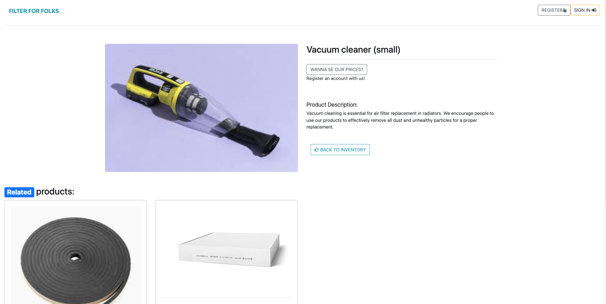
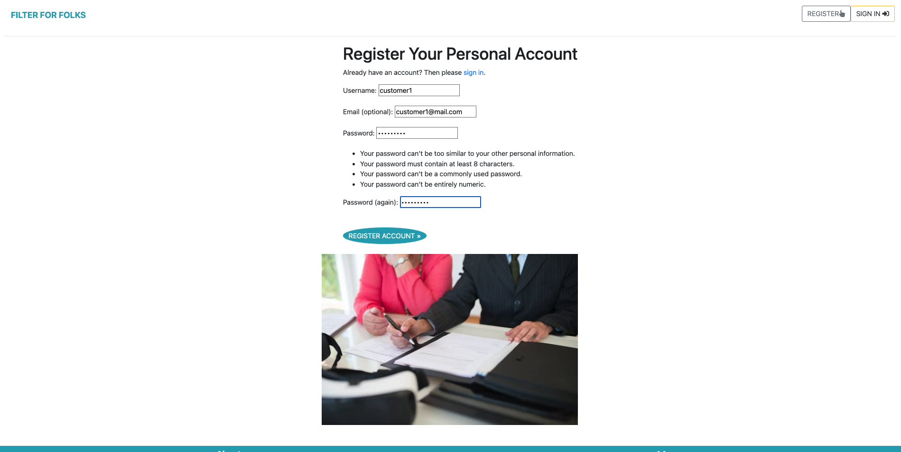

### Project Goals

Filter for Folks is a Business to Consumer (B2C) e-commerce site.

The sites primary audience will be people who are living in condominiums and require air filter replacement in their apartments.

- Create a user-friendly platform for consumers seeking ventilation filters for their condos.
- Provide a diverse selection of filters categorized by location and type for easy navigation.
- Implement secure registration, login, and checkout processes to enhance user trust and satisfaction.
- Offer clear product descriptions, pricing, and sizing options to aid in informed decision-making.
- Enable easy management of products and orders for efficient store operations.

### Disclaimer

This project was inspired by the Stockholm based company [Folkfilter](https://www.folkfilter.se/) that I used to work for as an account manager. It gave me the understanding related to the target audience and daily challenges I faced during my employment. I was also taken a break from this course at Code Institute before I worked on Filter for Folks.  

With this message I want to show them my gratitude that I was allowed to use their product images into my website. Other product images was taken through a google search and from another Swedish company calls [Biltema](https://www.biltema.se/). 

### User Stories

| User Story ID | As a/an | I want to be able to ... | So that I can... |
| :--- | :--- | :--- | :---|
| **VIEWING & NAVIGATION** |
| 1 | Shopper | view a list of ventilation filters available on Filter Folks | select the filter I need for my condo |
| 2 | Shopper | view specific categories of filters, such as those designed for placement behind radiators or above windows | to quickly find products relevant to my needs. |
| **REGISTRATION & USER ACCOUNTS** |
| 3 | Site User | Easily register for an account on Filter Folks| Enabling me to view my profile and order history |
| 4 | Site User | Easily log in or out | Access my personal account information |
| 6 | Site User | Have a personalized user profile | View my personal order history and order confirmations, and save my payment information |
| **SORTING & SEARCHING** |
| 7 | Shopper | Sort the list of available filters by price, rating, and category | To identify the best options for my needs. |
| 8 | Shopper | Sort a specific category of Air Filter | Find the best-priced or best-rated product in a specific category, or sort the products in that category by name |
| 9 | Shopper | Search for a product by name or description | Find a specific product I'd like to purchase |
| 10 | Shopper | Easily see what I've searched for and the number of results | Quickly decide whether the product I want is available |
| **PURCHASING & CHECKOUT** |
| 11 | Shopper | Easily select the size and quantity of filters I wish to purchase | Ensuring I order the correct products |
| 12 | Shopper | View  items in my shopping bag, adjust quantities if necessary | enter payment information securely for checkout. |
| 13 | Shopper | View an order confirmation after checkout | Verify that I haven't made any mistakes |
| 14 | Shopper | Receive an email confirmation after checking out | Keep the confirmation of what I've purchased for my records |
| **ADMIN & STORE MANAGEMENT** |
| 15 | Store Owner | Add a product| Add new items to my store |
| 16 | Store Owner | Edit/update a product | Change product prices, descriptions, images and other product criteria |
| 17 | Store Owner | Delete a product | Remove items that are no longer for sale |

---

## Design

### Colour Scheme

- This the total color scheme for the whole website. If I have must have missed something in there I must apologise in advanced before you continue to read this readme file further. 

### Imagery

The opening page was added from [Pexels](https://www.pexels.com/) and it was also used in other areas of the website to appear professional depending on the navigation. A few product images as mentioned in the beginning the readme file was taken from a simple [Google Search](https://www.google.com/webhp?hl=en&sa=X&ved=0ahUKEwjyuJSQxYaHAxWeAxAIHS0CDz0QPAgJ) e.g. [Rubber Strips](https://www.google.com/search?sca_esv=119356d5c00122f0&rlz=1C5CHFA_enSE941SE942&q=rubber+strips&udm=2&fbs=AEQNm0Aa4sjWe7Rqy32pFwRj0UkWd8nbOJfsBGGB5IQQO6L3J_TJ4YMS4eRay1mUcjRHkZwkNnuzbvXdHSnZt8SI-ypec-U-KajbXe9hbStxnPJuWxTCm8NISzlcRgh-mkg5a1XRWoiIVMkT5RYbraDRnHsJFse2AdcMQ0qNzsDHDLrzlWTINDALsSJJNGpMRvO4XnQg0w6_&sa=X&ved=2ahUKEwii2tiNxYaHAxWDLBAIHcy3CvAQtKgLegQIFBAB&biw=1440&bih=779&dpr=2) and from the Swedish hardwarestore [Biltema](https://www.biltema.se/en-se/). 

The reason for it was made this way was to save time and find a product image that easily represented of its usage for the potential buyer. I wasn't allowed to private photos of [Folkfilter's](https://www.folkfilter.se/) tools and they use to their air filter replacement services. 

### Facebook page 

- Facebook does not tolerate "fake" business profiles on its platform, so there's a risk that my business page might be deactivated if it's not deemed authentic, particularly if it was created using a new, empty Facebook user profile.

- To prevent any restraints regarding the presentation of my project in the readme.md file - I have  included some screenshots of the Facebook page in my documentation and followed those instructions by Code Institute. 

- If the Filter for Folk's [Facebook Page](https://www.facebook.com/profile.php?id=61561386792798) still exist -  please feel free to visit it!

---

## Technologies Used

### Languages Used

HTML, CSS, JavaScript, Python 3

### Databases Used

* sqlite3 - for the development database.
* ~~ElephantSQL - For the deployed sites database.~~ - ElephantSQL announced EOL for its service in February 2024.
* [Code Institute Database (DB)](https://dbs.ci-dbs.net/) For the deployed site database

### Frameworks Used

* [Django](https://www.djangoproject.com/) - A high-level Python web framework that encourages rapid development and clean, pragmatic design.

* [Bootstrap](https://getbootstrap.com/docs/4.6/getting-started/introduction/) - Version 4.6 - A framework for building responsive, mobile-first sites.

### Libraries & Packages Used

* [Django Allauth](https://django-allauth.readthedocs.io/en/latest/)  - Used for authentication, registration & account management.

* [dj_database_url](https://pypi.org/project/dj-database-url/0.5.0/) - Allows us to utilise the DATABASE_URL environment variable.

* [Stripe](https://pypi.org/project/stripe/) - Version 9.11.0 - To allow us to utilise the Stripe API for payments.

* [gunicorn](https://pypi.org/project/gunicorn/) - Version 22.0.0 - a Python WSGI HTTP Server

* [psycopg2](https://pypi.org/project/psycopg2/) - A postgres database adaptor.

* [pillow](https://pypi.org/project/Pillow/)  - A python imaging library.

* asgiref

* [django-countries](https://pypi.org/project/django-countries/7.6.1/) - This is the latest stable version that is compatible with GitPod

* [django-crispy-forms](https://pypi.org/project/django-crispy-forms/) - provides a tag and filter that lets you quickly render forms

* oauthlib

* pytz

* requests-oauthlib

* sqlparse

* psycopg2 - a postgres database adapter which allow us to connect with a postgres database

* django-storages - a storage backend library

### Programs Used

* [GitHub](https://github.com/) - To save and store the files for this project.

* [Pip](https://pypi.org/project/pip/) - A tool for installing Python packages.

* [Google Dev Tools](https://developer.chrome.com/docs/devtools/) - To troubleshoot, test features and solve issues with responsiveness and styling.

* [Mail Chimp](https://mailchimp.com/?currency=SEK) - To create newsletters. 

* [Color Scheme](https://coolors.co/000000-2f1000-621b00-945600-c75000) - To create colorschemes. 

### Stripe

* [Stripe](https://stripe.com/gb) has been used in the project to implement the payment system.

Stripe for the website is currently in developer mode, which allows us to be able to process test payments to check the function of the site.

| Type | Card No | Expiry | CVC | ZIP |
| :--- | :--- |:--- | :--- | :--- |
| Success| Visa | 4242 4242 4242 4242 | A date in the future | Any 3 digits | Any 5 digits |
| Require authorisation | 4000 0027 6000 3184 | A date in the future | Any 3 digits | Any 5 digits |
| Declined | 4000 0000 0000 0002 | A date in the future | Any 3 digits | Any 5 digits |

Stripe Documentation- setting up stripe elements to accept payment [docs](https://stripe.com/docs/js)

---

## Features

#### New Visitor view:

1. Once you come to the Filter for Folks website the opening page looks like this: 

2. As visitor you have multiple options. For starters if you can click on the "OUR INVENTORY" button to come the total inventory page. 

3. In there you are able to see the product description and images of each product, however to prevent other competitors to see what our prices are we have set up a function that a new visitor needs to register an account at Filter for Folks. 

4. This is to generate substantial amount of traffic to the website and arouse curiosity. Once you click on the gray button that says "Wanna see our prices?" it takes you to the register page.

#### Registered Personal Account view:

5. Once you have created an account it it greats you with a new message on the home page. This is an indication that you're in and a sense of change within the navigation for the visitor. Who is now our full customer with more accessibility on the page. Besides has the navbar been updated:

6. The navbar has also been updated for the user. With 3 new buttons to account member. Once you click on uppercase button "search products". You'll enter product filter page.  

7. In the tab to the left of the product filter you are able to type your product of interest in the search bar. e.g, you search toolbox: 

8. However, in order to see all the products again and make another product search you need to press on default button to clear the filter. 

9. If chooses one of the categories you'll see either one or several items in the filter. * As mention the user needs to use the default filter button to see all the inventory again. * 

#### Purchase experience view:

10. If you decides to you purchase something, then you click on one of the products. In this case we purchases a vacuum cleaner: 

11. You immediately navigated to the product detail page where you decides if you want to add this item into the shopping cart and its quantity. Plus you see an update in terms of its color (from gray to turquoise) and quantity in the cart. 

12. In the shopping it looks like this where you can do its changes and or if you want to delete the product entirely. This is before you do your checkout:

13. Right after you click on secure checkout you'll be navigated to the checkout page where you can add the required personal details for you purchase:

14. Once you clicked on the secure checkout you will be receiving a purchase confirmation: 

#### Tracking purchase view:

15. As a user you are able to do some updates in your personal account, if your personal details has changed and also you can look on previous orders (related to your personal account) - you'll able to find this necessary information there. Plus by clicking on the "order number" you'll be navigated back to the confirmation page. Thus it's an easy user experience to the customer and also important if they want to call or send an email to the Filter for Folks customer service in case of tracking the order. 

#### Reach out to the business view:

16. If you want to reach out to the business you need to click on the "contact" button in the footer below or the second nav element. The user can either contact by either email and calling the store. On the contact page the user is able to sign up for the newsletter connected to the Mail Chimp and find Filter for Folks Facebook page. (How the facebook looks like you'll find it above).

17. How do you get yourself back to the home page? Either clicking on the business name "Filter for Folks" in the top left - in the nav element below. In there you also find the page of Filter for Folk's [Privacy Policy](https://www.termsfeed.com/live/1a7cc1bc-3fec-45b9-87a8-a43810a76fdf) to their users and how they are following the [GDPR](https://gdpr-info.eu/).  

#### Sign In & Log Out views:

18. Once you want to leave the website you are clicking on the "logout" button in above nav element and the same comes to if you already have an account though you click on "Sign In" instead: 

19. Once you click on the sign out then you log out from the page. 

20. The user who clicks on the Sign In button will be directed to this page: 

#### Admin view:

21. If you are an admin you are been allocated with a green button that's being called add product. This is to add some new products for the admin into the page and for customer to see how much they have spent in the cart area.

22. The add product page looks like this as the admin can choose name, which category that particular product belongs to, description, price and image. 

### Future Implementations

Favicon - wasn't implemented into the project. The reason behind this was that I started my project from scratch and didn't use Boutique Ado as foundation in beginning. Neither allauth packages thus some templates are in the allauth folder and other in core app. 

A feature that unfortunately was not implemented into the project is that the admin is able to create an category to further enhance the website for its liking.

## Credits to my mentor

I want to show my gratitude to my mentor at Code Institute, who guided me in this project. 

- Jubril Akolade 

I also want to highlight my previous mentor who supported me the whole course: 

- Martina Terlevic

## Credits to TUT Support on Code Institute

- John
- Roo 
- Oisin
- Roman
- Sarah
- Thomas 
- Holly
- Rebecca 
- Lewis
- Martin 
- Jason 
- Alan 
- Gemma
- Sean 
- Scott 

## Instructions if the workspace fails:

##### Follow these steps: 

- pip3 install 'django<4'
- pip install django-crispy-forms
- python -m pip install Pillow